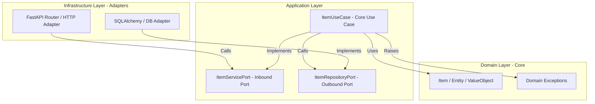

# Hexagonal Backend Template

> A production-ready Python **Hexagonal Architecture (Ports & Adapters)** template.
> Engineered with **FastAPI**, **UV** package manager, **SQLAlchemy 2.0 (async)**, and robust remote and local CI/CD pipelines.

---

## 🏗️ Repository Architecture & Directory Structure

This project follows strict **Hexagonal Architecture** (Domain-Centric) principles. Sub-domain components are isolated, and dependencies only flow inward.

```
hexagonal_backend_template/
├── .agents/                    # AI agent guidelines, rules, and skills
├── docker/                     # Docker Compose utility stacks and Dockerfile
│   ├── docker-compose.local.yml  # Local developer dependencies (PostgreSQL)
│   ├── docker-compose.sonar.yml  # Local SonarQube quality gate instance
│   └── Dockerfile              # Production multi-stage Dockerfile
├── docs/                       # Project documentation single source of truth
│   ├── CONSTITUTION.md         # Repository principles and strict rules
│   ├── GETTING_STARTED.md      # Detailed developer setup instructions
│   └── LOCAL_CI_GUIDE.md       # Pre-push security and linting checks
├── src/
│   ├── env/                    # Configuration and Environment variable files
│   └── app/
│       ├── domain/             # Core business models, exceptions, and logic
│       ├── application/        # Inbound and Outbound Ports (ABCs) + Use Cases
│       └── infrastructure/     # Adapters (HTTP, Persistence) + DI wiring
└── tests/                      # Core test suites (Unit, Integration, Architecture, Contract)
```

### 🧬 Hexagonal Architecture Flow



---

## 🛠️ Tech Stack

| Concern | Tool |
|---|---|
| Language | Python 3.14+ |
| Package Manager | [UV](https://docs.astral.sh/) |
| Framework | FastAPI |
| Database | PostgreSQL (asyncpg + SQLAlchemy 2.0) |
| DI Container | `dependency-injector` |
| Style / Linting | Ruff (Format + Linter) |
| Type Checking | MyPy |
| Security Scanning | Bandit + Pip-audit |

---

## 🚀 Setup & Installation

### 1. Synchronize Dependencies
Ensure [UV](https://docs.astral.sh/) is installed, then run:

```bash
# Clone the repository
git clone https://github.com/SergioZona/hexagonal_backend_template.git
cd hexagonal_backend_template

# Sync and install environment
uv sync --group dev
```

### 2. Configure Local Secrets
Local defaults are already loaded from `src/env/.env` (gitignored). Copy the file and fill in your secrets:

```ini
# src/env/.env  — local developer secrets
DATABASE_PASSWORD=your-local-password
SECRET_KEY=your-local-secret
```

---

## 🏃 Running the Application

Start the live-reloading FastAPI development server using the appropriate command for your operating system:

### 💻 Bash / WSL / macOS
```bash
APP_ENV=dev DATABASE_PASSWORD=localpass SECRET_KEY=dev-secret \
  uv run uvicorn app.infrastructure.main:app --reload --host 0.0.0.0 --port 8000
```

### 🐚 PowerShell (Windows)
```powershell
$env:APP_ENV="dev"; $env:DATABASE_PASSWORD="localpass"; $env:SECRET_KEY="dev-secret"
uv run uvicorn app.infrastructure.main:app --reload --host 0.0.0.0 --port 8000
```

The Swagger Interactive Docs will be accessible at: `http://localhost:8000/docs`

---

## 🧪 Local CI & Quality Pipeline

To maintain branch stability, you **MUST** execute the local pre-push check pipeline in this exact order:

| Step | Command | Purpose |
|---|---|---|
| **1. Ruff Format** | `uv run ruff format src/ tests/` | Auto-format codebase |
| **2. Ruff Lint** | `uv run ruff check src/ tests/ --fix` | Check style & code smells |
| **3. Type Check** | `uv run mypy src/` | Static type enforcement |
| **4. Test Suite** | `uv run pytest tests/` | Run all test boundaries |
| **5. Security** | `uv run bandit -c pyproject.toml -r src/` | AST vulnerability scan |
| **6. Audit** | `uv run pip-audit` | Check locked dependencies for CVEs |

### 🔗 Chained One-Liner Execution

#### Bash / WSL / macOS
```bash
uv run ruff format src/ tests/ && \
uv run ruff check src/ tests/ --fix && \
uv run mypy src/ && \
uv run pytest tests/ && \
uv run bandit -c pyproject.toml -r src/ && \
uv run pip-audit
```

#### PowerShell (Windows)
```powershell
uv run ruff format src/ tests/; if ($?) { uv run ruff check src/ tests/ --fix }; if ($?) { uv run mypy src/ }; if ($?) { uv run pytest tests/ }; if ($?) { uv run bandit -c pyproject.toml -r src/ }; if ($?) { uv run pip-audit }
```

---

## 🐳 Docker Services

Docker compose files are located in the `docker/` directory to keep the root directory clean.

### Local Development Database (Postgres)
```bash
# Start Postgres local service
docker compose -f docker/docker-compose.local.yml up -d

# Stop Postgres local service
docker compose -f docker/docker-compose.local.yml down
```

### SonarQube Code Analyzer (Local)
```bash
# Start local SonarQube
docker compose -f docker/docker-compose.sonar.yml up -d

# Stop local SonarQube
docker compose -f docker/docker-compose.sonar.yml down
```

---

## 📚 Reference & Further Reading
For advanced workflows, design rules, and architectures, refer directly to:
- [📜 Project Constitution](docs/CONSTITUTION.md) — The ultimate code standards and architecture restrictions.
- [🚀 Getting Started Guide](docs/GETTING_STARTED.md) — Deep-dive developer guides and domain creation steps.
- [🔍 Local CI Checks Guide](docs/LOCAL_CI_GUIDE.md) — How to troubleshoot formatting, type errors, or security scans.
- [🧬 Architecture Boundaries](tests/architecture/test_boundaries.py) — Programmatic Hexagonal rule enforcement tests.

---

## 📝 License
This project is licensed under the [MIT License](LICENSE).
